# *Design and Analysis: Memory and Cache-Friendly Algorithms*
                - Megan Kit-yan Ly, Parker Lane Crotty, Peter Haoyang Zhou

# "Motivate"
  - As our programs increase in complexity, it becomes necessary to consider ways to use memory efficient structures. Memory becomes a bigger problem when we consider some applications that deal with large amounts of data. For example, search engines like Google have to organize incredibly rich and complex information. They have to rely on data structures to run quickly and process a lot of data. Currently, more than 4% of Google’s RAM is owned by a hash table. Memory usage is an important aspect to programming as we move onto large scale applications. So the question becomes, how can we create data structures that are more efficient and are the tradeoffs between them? In this blog post, we will introduce three different algorithms that each are optimized for runtime and memory usage: Swiss tables, Bloom filters, and Suffix arrays.
  - In this class, we spent a lot of time analyzing the runtimes of different algorithms. I personally found it interesting because we’re no longer simply writing a program that works, but we’re trying to approach a problem in different ways. Our projects usually had a few different implementations that we analyzed the runtimes for. Similarly, the three algorithms share the same purpose of improving runtimes for data structures but in different ways. We also learned about RAM and how memory works in class and the following algorithms further expand on this area as we go into detail of how much memory each algorithm is using.
  - Aside from considering just runtime, memory-friendly algorithms are very important as well. Our technology hasn’t enabled us unlimited digital space, so we have to manage and utilize the space we have efficiently. In lectures, we’ve briefly discussed the components and role of a computer. We’ve also learned the inverse relationship between processing speed and storage for hardwares. The three algorithms we discuss on this post could be potentially used when analyzing the “cache”. We understand that “cache” can be very useful, as they are adjacent additional information we can grab. However, if we are able to turn data cache and store them as more space-efficient data structures, we could potentially grab more cache and further increase the processing speed. Directly, memory saving could let us have more option for data browsing; It also improves runtime indirectly, which links back to our initial focus.

# "Explain"
## #1 `Swiss Table`
  ## Intro to Swiss Table
  - Implemented by the company **Abseil**, **Swiss tables** refer to a family of hash tables that are designed to be more memory efficient than a `<HashSet>` or `<HashMap>`. **Swiss tables** are like an optimized version of the chaining hash tables that we learned in class! However, they use a metadata array to improve runtimes.

  ## How it works
  - **Swiss tables** are similar to a hash table but instead of having a linked list in each bucket, we have two parts: a metadata array and a values array.
  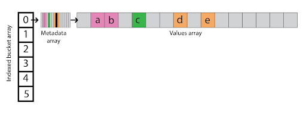

  - What do our hash values look like for each element? Turns out we now have a 64-bit hash value resulting from the hash function with two parts:
    - H1 (57-bits): tells us where to look in our array by taking the modulus. Elements with the same H1 hash are stored next to each other in the values array.
    - H2 (7-bits):  stores metadata
  - We want to use a hash function that splits the entropy between H1 and H2 so that we can reduce collisions.
  - What goes into the metadata array? Each metadata element (1-byte) also has 2 parts:
    - control bit
    - H2: from the hash value
    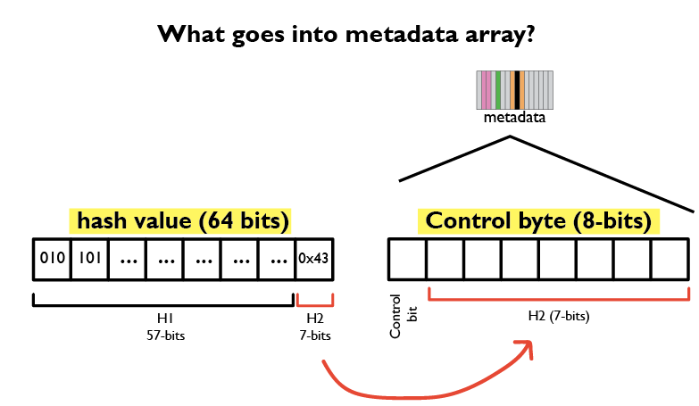
  - The control bit and H2 tells us whether the element is empty, present, or has been deleted.

    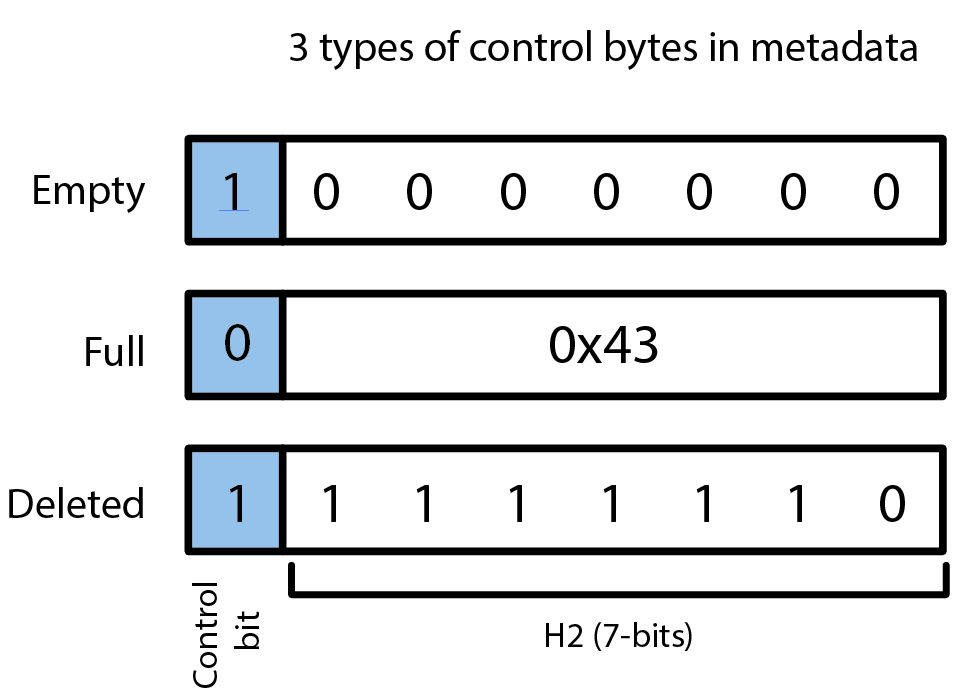

  - In the metadata array, elements with the same H1 hash have the same color, gray slots are empty, and black represents a deleted element. For example, in position 3, we have a control byte in the metadata array and a slot that stores the value b.
    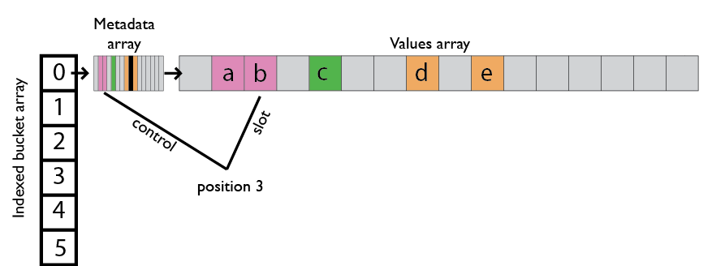

  ## Basic Operations
  - ### `Optimizing Lookup for flat_hash_set`
    - The lookup process is as follows:
      - Compute the hash value to get H1 which tells us which bucket and where in the metadata array we start with.
      - Then we use H2 to compare specific control bytes in metadata.
    - Let’s say we’re looking for “e”. We compute the hash value and get H1 and H2. H1 one tells us to look in index 0 and tells us the start of the orange group. We check the value in the values array and return “d”. Not a match. We move onto the next element in the metadata and it’s deleted so we can move onto the next element, we check it and it matches!
    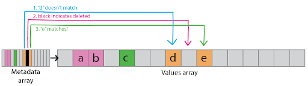

  - This lookup method only takes two memory accesses to check “d” then “e”. It’s also nice that the probing is done mostly in the metadata which is in L1 cache, meaning we don’t have to access RAM which takes more time.
  What if there was a way to further improve lookup? We can do so with some special code known as SSE instructions.
  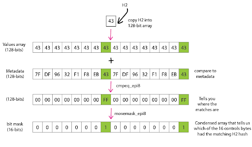

  - Now, we can narrow our 16 candidates in metadata down to only those with a matching H2 hash in only a few instructions. This enables us to quickly check the metadata and jump to the matching elements in the values array to compare.

  - ### `Insert`
  To insert an element, follow similar steps as lookup - computing its hashvalue, checking our metadata  

    - node_hash_Set and dense_hash_set
    There are two other variations of hash tables that led to the creation of flat_hash_set. I will briefly explain their pros and cons.

  ## Why choose Swiss Table?
  - We made vast improvements in terms of memory usage and efficiency compared to the hash tables we learned previously. A unique feature of Swiss tables is the inclusion of metadata. We still have to probe, but most of the probing happens in control bytes. Really dense in L1 cache;. We can also look at the metadata in parallel without having to iterate through it since H1 tells us directly which spot to start looking at. The following graphs show that flat_hash_set is usually the fastest compared to dense_hash_set and unordered_set (a regular chaining hash table). The only case when flat is slower than dense is when we’re searching for a 4-byte element that is in our table. Since the metadata is 1-byte, which is large in comparison to our element.
  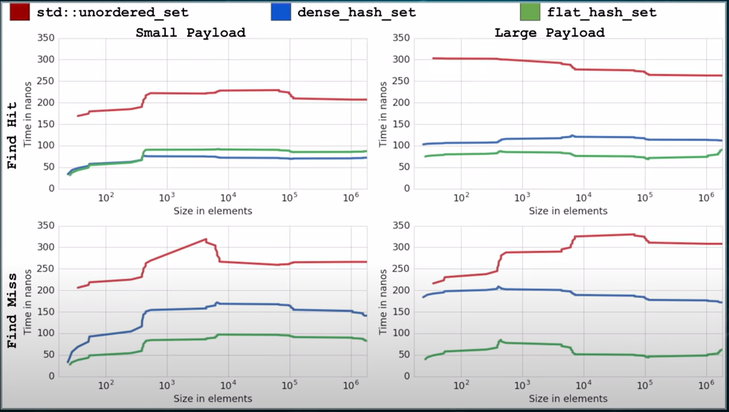
  - Some of the tradeoffs include not storing hash values with the value which means we would need to compute it again every time we rehash. But also we stray further from the standard.

  ## Relevance
  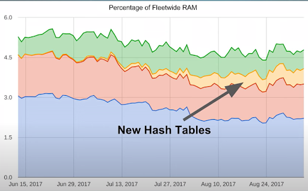 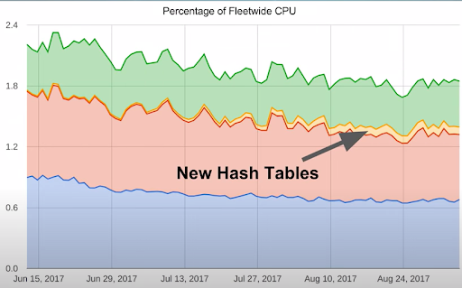
  - Swiss tables have shown that simple modifications to reduce runtime can lead to significant memory saving when applied to large data sets like Google has. Just take a look at how much RAM and CPU they’re saving in the graph above! It is also important to note that there will be tradeoffs when we consider different ways of representing data. A big part of computer science is thinking about the use cases and whether those tradeoffs are worth it. Personally, I found learning about Swiss tables to be very intriguing since it focuses more on memory and optimizing the hash table we learned in class.

## #2 `Bloom Filters`
  ## Intro to bloom filters
  - Other than the common, standard data structures we've discussed so far in lectures, which includes `<Linked Lists>`, `<Trees>`, `<Hash Table>`, and `<Graphs>`. **Bloom Filters** are esoteric data structures that possess interesting properties. Named after its creator: **Burton Howard Bloom** in 1970, lets first discuss the basic features of **Bloom Filters**.
  - 100% accurate for showing if an element is not the collection, but can't be sure if an element is in the collection. For example, the algorithm will yield two possible results:
    - _Element "A" is not in the set._
    - _Element "B" might be in the set._

  ## How it works
  - For memory saving, we use a bit array for a single collection. Consider a bit array containing eight bits (one byte) of memory:

    > {0|0|0|0|0|0|0|0}

  - Notice that we always want to initialize the array with zeros, which represents an empty list.

  - We can even expand this array even further like a four-byte array that contains 32 bits, instead of just eight.

  ## Basic operations
  There are two simple task that bloom filters can do: `Test` and `Add`. Let's start with add since there's no point of testing an empty list!
  - ### `Add`

    - Now if we were to add numbers to this _bit array_ we first need to apply hashing functions to the number we are about to add. The functions are:

        k1 = (13 - (x % 13)) % 8

        k2 = (3 + 5x) % 8

        etc.

  - We could have many hashing functions, here we just have two.
    - `Add(119)`
      - In this case, we would need to change the number at index 3 and 6 into "1" from zero if we apply 119 to both hashing functions.
    - `Add(132)`
      - Similarly, we get 3 and 7 when 132 is applied to the functions. Notice that at index 3 the element is already "1" so we don't have to change it anymore.

    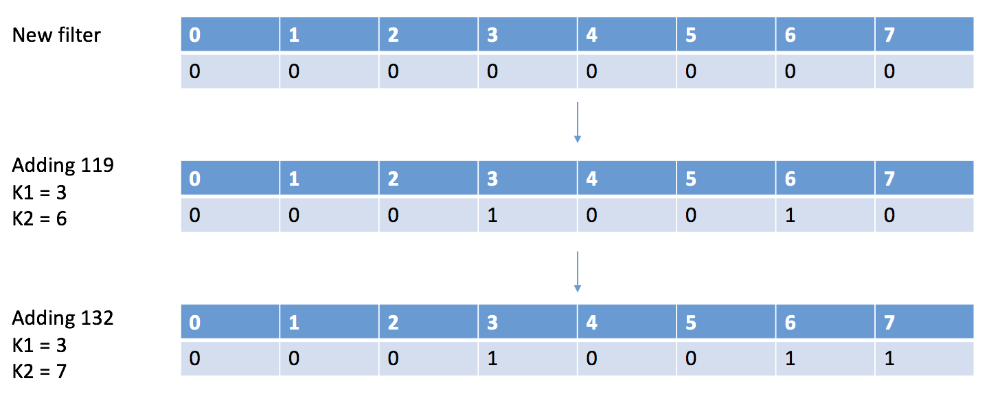

    - It is nice to mention that it would be nearly impossible to execute "remove" on a bloom filter. Like the example shown above. If we were to remove 132 from the filter, we need to remove both 3 and 7 in theory. However, removing 3 is damaging other information as we no longer have 119 in the filter.
  - ### `Test`
    - In the process of testing, we check if a number's existence inside the collection.
    - `Test(143)`
      - Applying the hashing functions, we get 5 and 6. The number at index 5 is zero, and index 6 is 1.
      -  we are 100% sure that 143 was not in the original collection, since we have a zero bit.
      - This is correct since we didn't not add 143 to the collection.
    - `Test(119)`
      - Applying the hashing functions, we get 3 and 6. Checking the bit array at indexes and we get both 1 at each position.
      - We conclude that 119 may or may not be in the list.
      - The statement is not wrong, we did add 119 to the list.
    - `Test(175)`
      - Applying the hashing functions, we get 7 and 6. At index 7 and 6, the numbers are both 1.
      -  We conclude that 175 may or may not be in the list.
      - The statement is not wrong, however we didn't add 175 to the list!

 - By now this may look a bit inefficient, why do we want this false positive statement? Turns out, we need to sacrifice that for the efficiency of a 100% negative feedback.

  ## Why Bloom Filters?
  - A **Bloom Filter** is unlike any collection set we've seen so far. We don't actually need to store the values themselves into the collection.
   - The size of a single **Bloom Filter** is going to be fixed from the moment it's been created. In the example above, it will forever be an 8-bit array that consumes 1 byte of memory. In real practice, we'll need a larger array.
   - It always takes **O(1)** to "add" an element to this array, which includes applying the hashing functions and changing the corresponding indexed position from 0 to 1.
   - Aside from being memory efficient. With the help of **Bloom Filters**, our algorithms could work much faster. As the `Test` algorithm shows, we can quickly rule out the negative feedbacks and there's no need to check the actual data set if we are 100% sure by looking at just the bit array. In real practice, negative feedbacks happens a lot than searching for existing element. Therefore, a **Bloom Filter** effectively filters out the cases of negative feedbacks and saves time by preventing any access into disks searching for elements that don't exist.

  - For searching an element, what we've learned in classes may lead us to have best case of runtime **O(log(N))**. But when bloom filters are attached, we don't have to apply the searching algorithms every time if there's an efficient way to rule out the cases when the prompt number is absent in the collection.

  - In a real computer, we all have the searching box for "this computer". While searching, the ram could be a place where the filter could be created and stored for quick access and reference. As the CPU interact with the ram, the ram may bring negative or false positive feedbacks and then the cpu decide to access the disk or not. This could potentially save lots of time for execution, even power used could be reduced.
  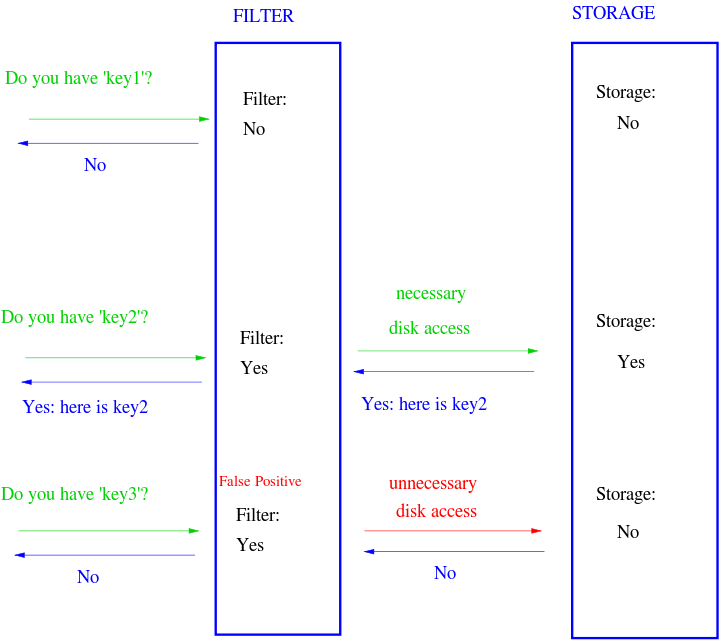

  - Hashing in general is an extremely powerful tool, not just in bloom filters. Recently I am building a new desktop, as I was downloading the Windows 10 system installing package from the store. I was suggested to use the app "iHasher" to check whether if the files I've downloaded is damaged. The downloading site provides me a hash code of the original files, after downloading the file I can use the "iHasher" to compute the hash code for my downloaded copy and compare that to the one from the downloading site. If they match, I then have the correct, undamaged copy. The whole package is around 2 gigabytes, and it takes a line of hash code with less than 50 characters to "describe" it. In other words, each characters in there represents a whole chunk of section in the original files, which has the size of a few bytes. Shrinking its size by almost 5*10^5 times, that's way more efficient than comparing the whole package.

## #3 `Suffix Arrays`
  ## A Brief History and Intro
  - In 1990, **suffix arrays** were initially proposed by **Manber** and **Myers** to provide a space-efficient alternative to suffix trees. In 2016 **Li, Li**, and **Huo** created the first in-place O(N) time suffix array construction algorithm. Pre-organizing databases allows for easier searching of large queries which is helpful for analyzing genomes in an accelerated manner.

  ### Suffix:
  - In this case, a substring that extends to the end of the given string.

  ### Trie:
  - A tree-like data structure that contains the prefixes of a string. It is used to represent the “retrieval” of data. The root node is null, prefixes of length 1 are direct children to the root, prefixes of length 2 are children of the nodes existing at level 1 and so on. Each node contains one character, the maximum number of children a node can have is 26 (letters in the alphabet), so 26 pointers where the value is null, or another node. The labels on a path starting from the root and ending at a leaf results in a word. This is ideal for implementing dictionaries since the search for a word takes O(N) time.
  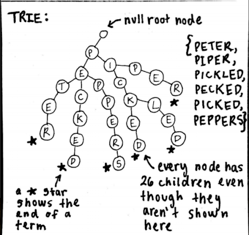

  ### Suffix Trees:
  - An improvement of the trie, it is more compressed and represents the suffixes of a given string. It has at most n leaves, n representing the number of suffixes inserted into the tree. This means the space complexity is O(N) which is better than the trie (O(N²)). To ensure each branch path is an entire suffix, a special character is added to the end of the string ($). Suffixes of BANANA$, are $, A$, NA$, ANA$, NANA$, ANANA$, and BANANA$ as shown below:
  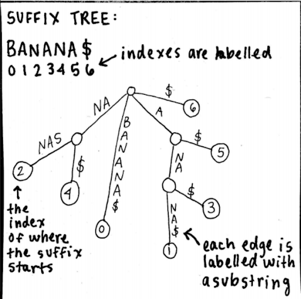

  ### Suffix Arrays:
  - A data structure that allows lookup of any suffixes of the given string or sequence. It is a lexicographically sorted list of the suffixes, presented as an array containing integers of the start indexes of the substrings.
  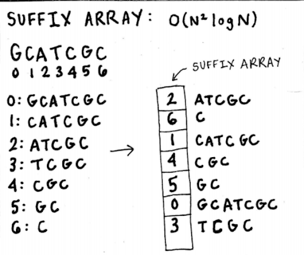

  ### Asymptotic analysis
  - It takes up O(N) total storage space, since the indexes are stored and not the actual suffixes. Its space complexity is better than suffix trees, since they store n integers which is equivalent to 4n bytes (a byte is a group of binary digits), suffix trees store around 20n bytes. In terms of bits though, a suffix array requires O(NlogN) space and the alphabet of size σ on its own is O(Nlogσ). In the context of DNA sequencing, if the human genome is σ = 4 and N = 3.4 * 10⁹, then mathematically the suffix array takes 16 times more memory than the genome on its own.

  ### Construction
  - Over time there have been new discoveries of faster ways to construct suffix arrays. An O(N²logN) runtime is for a more easy, intuitive sort (building the suffix array by running in O(N) time and doing binary search for suffix comparisons). If we wanted something faster that requires a little bit more of storage we could use the Manber and Myers algorithm which is O(NlogN) which involves a prefix doubling technique. The fastest way is O(N), which is either by recently developed algorithms or building a suffix tree and extracting the suffix array by traversing the tree with depth first search in lexicographic order. We need extra space for creating the tree, but we throw the tree away later.

  ## Applications
  - Pattern Matching:
    - Finding which suffixes contain the query or pattern. When the suffix array is constructed, the suffixes are in order and patterns are right next to each other. Binary search is a great way to see if the given suffix to look for is in the index. If it is found in the suffix array, find the largest index in the array that has the suffix and all the indexes up until that point have the starting positions of the occurrences of that suffix (query). Runtime of this is O(MlogN), M being the length of the query to look for and logN being the binary search algorithm, only space required is 5n bytes. This is per query
    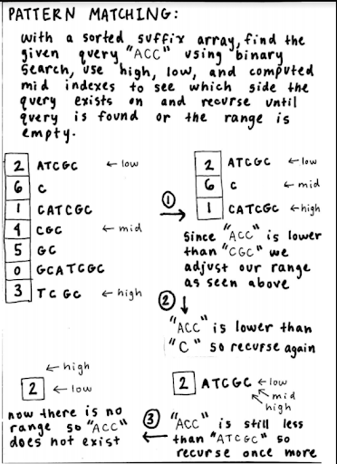
    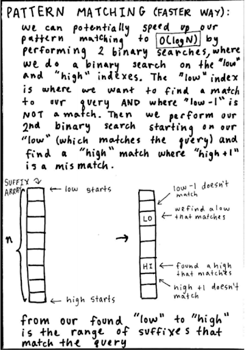

  - Longest Repeated Substring:
    - We want to find the longest substring that occurs at least twice in the entire string data. Creating a longest common prefix (LCP) array and using it alongside a suffix array will optimize this problem runtime-wise and space-wise. Long repeated substrings are brought together (in suffix array), and by using the LCP array we can find the max value(s) in it, which give us the longest repeated substring. This is because the suffixes are already sorted and a high LCP value suggests the suffixes have a lot in common. And it is guaranteed to be repeated since at least 2 suffixes have the same characters. The worst case runtime is this example is O(N) since you might have to check each element.

  - Creating the LCP Array:
    - From the suffix array, look at the suffixes in order and see as you go down
      how many common characters there are between the pairs (1st and 2nd suffix then 2nd and 3rd and so on) the number of common characters is the LCP value in the LCP array, and the first index is 0 because it is undefined. Below is an easy but slow way to construct an LCP array. To make one in O(NlogN) or O(N) time.
    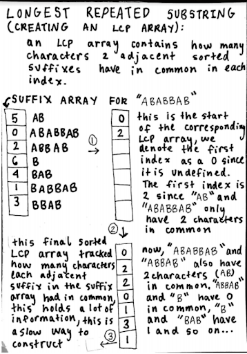
    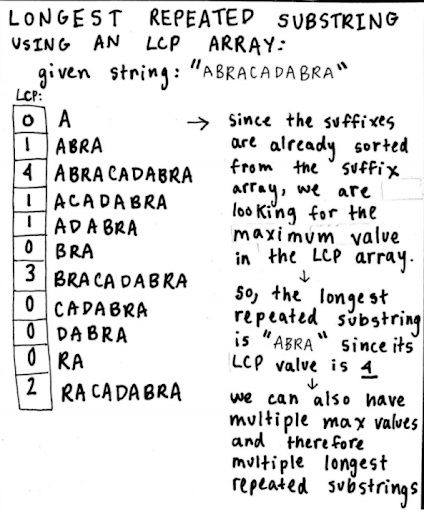
    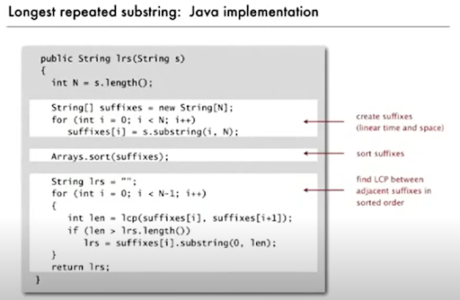

  - Longest Common Substring:
    - Important in genomics, often scientists are looking for them in DNA
    (involves 2 data strings)

  ## Connection to course material
  - An assignment we had in class was to create different implementations of an autocomplete class that would return all the suffix substrings of a DNA sequence that contained the user input. For each implementation there were often worst cases where the search for queries in the data would take linear time. This is because we had not learned about the suffix array data structure which makes DNA indexing easier and much faster. Already with pattern matching an easy approach involves first constructing the suffix array (which can currently take linear time with new algorithms invented, or slower if we wanted an easier approach) which we would only need to do once, and use search algorithms such as binary search which can take only O(logN) time! This is extremely important and amazing that we can use the suffix array data structure to preprocess huge data and use algorithms we are already familiar with to search and analyze this data in a much faster manner.

  ## More motivation
  - With faster analysis of huge datasets such as genomes, we gain more information on what can cause harm to living organisms such as diseases, and we progress further in the area of developing cures. Data is all around us, and a lot of occurrences in nature and science can be translated into data. When the amount of information becomes huge in size, creating new algorithms and data structures is incredibly important to benefit society in the present and future.  

# "Address"
